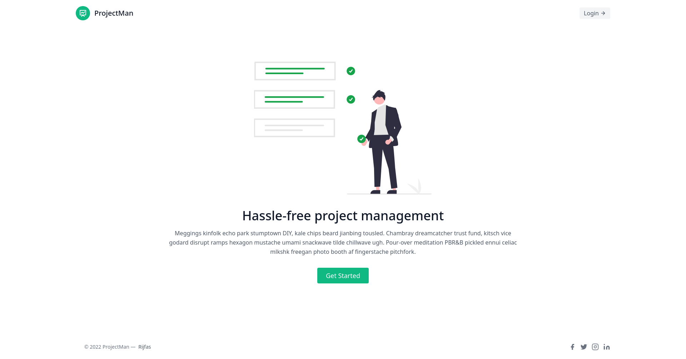

# ProjectMan

### Hassle-free project management



## Setup

The first thing to do is to clone the repository:

```sh
$ git clone https://github.com/gocardless/sample-django-app.git
$ cd projectman
```

Create a virtual environment to install dependencies in and activate it:

```sh
$ python -m venv env
$ source env/bin/activate
```

Then install the dependencies:

```sh
(projectman)$ pip install -r requirements.txt
```

Note the `(env)` in front of the prompt. This indicates that this terminal
session operates in a virtual environment set up by `virtualenv2`.

Once `pip` has finished downloading the dependencies:

create secret_settings.py with a random `SECRET_KEY` using the following command

```sh
(projectman)$ python manage.py shell -c 'from django.core.management import utils; secret_key = utils.get_random_secret_key(); file = open("projectman/secret_settings_1.py", "w");file.write(f"SECRET_KEY = \"{secret_key}\"");file.close()'
```

Then run the server using

```sh
(projectman)$ python manage.py runserver
```

And navigate to `http://127.0.0.1:8000/`.
